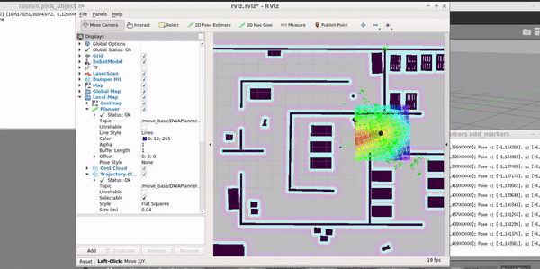
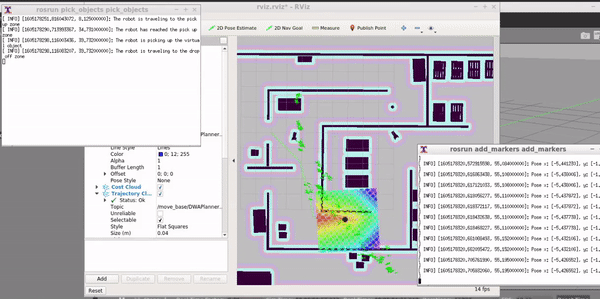

# Home service robot with ROS
[](https://www.udacity.com/course/robotics-software-engineer--nd209)

## Outline

Programmed a robot to autonomously pick-up and drop-off an object. This was achieved through two nodes: the __pick_objects__ and the __add_markers__.   
The pick_objects node commands the robot to move to the chosen pick-up and drop-off zones. While the add_markers node subscribes to the robot odometry, keeps track of the robot pose, and publishes markers to rviz.

<div align="center">
    
</div>
The robot is shown leaving the starting point and reaching the pick-up location.

<div align="center">
    
</div>
The robot is shown leaving the pick-up point and reaching the drop-off location.

## Install Details

First check for any package updates.  
`$ sudo apt-get update `

Then install the ROS kinetic package.  
`$ sudo apt-get install ros-kinetic-desktop `

Once the package is upto date, create the catkin workspace.
```
$ mkdir -p ~/catkin_ws/src
$ cd ~/catkin_ws/src
$ catkin_init_workspace
$ cd ~/catkin_ws
$ catkin_make
```

Then clone the official ROS packages into the workspace.
```
$ cd ~catkin_ws/src
$ git clone https://github.com/ros-perception/slam_gmapping.git
$ git clone https://github.com/turtlebot/turtlebot.git
$ git clone https://github.com/turtlebot/turtlebot_interactions.git
$ git clone https://github.com/turtlebot/turtlebot_simulator.git
```

## Structure Overview

Below the structure of the files is shown.
```
catkin_ws/src
    ├──                                # Official ROS packages
    │
    ├── slam_gmapping                  # gmapping_demo.launch file                   
    │   ├── gmapping
    │   ├── ...
    ├── turtlebot                      # keyboard_teleop.launch file
    │   ├── turtlebot_teleop
    │   ├── ...
    ├── turtlebot_interactions         # view_navigation.launch file      
    │   ├── turtlebot_rviz_launchers
    │   ├── ...
    ├── turtlebot_simulator            # turtlebot_world.launch file 
    │   ├── turtlebot_gazebo
    │   ├── ...
    ├──                                # Custom packages and directories
    │
    ├── map                            # map files
    │   ├── ...
    ├── scripts                        # shell scripts files
    │   ├── ...
    ├──rvizConfig                      # rviz configuration files
    │   ├── ...
    ├──pick_objects                    # pick_objects C++ node
    │   ├── src/pick_objects.cpp
    │   ├── ...
    ├──add_markers                     # add_marker C++ node
    │   ├── src/add_markers.cpp
    │   ├── ...
    └──
```
